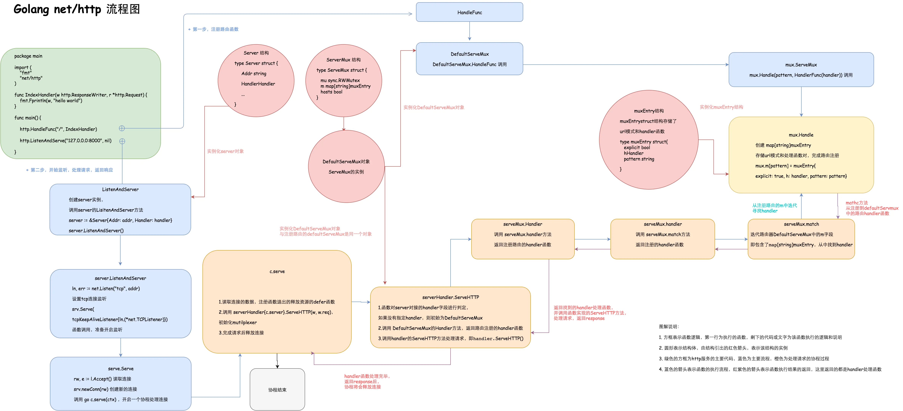

本项目实现了一个类似gin的web框架
### 基础知识
本项目基于golang的net/http包进行封装得到。

HTTP 构建的网络应用只要关注两个端---客户端（clinet）和服务端（server），两个端的交互来自 clinet 的 request，以及server端的response。所谓的http服务器，主要在于如何接受 clinet 的 request，并向client返回response。
接收request的过程中，最重要的莫过于路由（router）。所以真个过程可以总结为：
```
Clinet -> Requests ->  [Multiplexer(router) -> handler  -> Response -> Clinet
```
一个Go最简单的http服务器：
```
package main

import (
    "fmt"
    "net/http"
)

func IndexHandler(w http.ResponseWriter, r *http.Request) {
    fmt.Fprintln(w, "hello world")
}

func main() {
    http.HandleFunc("/", IndexHandler)
    http.ListenAndServe("127.0.0.0:8000", nil)
}
```
其中http.HandleFunc("/", IndexHandler)注册路由函数，

ServeHTTP()方法很简单，就是先查找路由，然后执行对应的处理函数Handler的ServeHTTP()执行业务逻辑。
在运行http.ListenAndServe时会调用ServeHTTP()。

http.ListenAndServe("127.0.0.0:8000", nil)监听8080端口，接收请求，根据路由找到处理函数处理请求。
直接使用http构建web的流程图为：

### gee
本项目主要实现三个部分：
1、本项目的本质是对路由注册进行重新定义，添加各种功能

2、实现ServeHTTP()，查找路由

3、对http.ListenAndServe("127.0.0.0:8000", nil)进行简单封装


### 注册路由实现的功能
1、封装上下文，在上下文中实现中间件（包括错误恢复和日志文件）、分组控制和动态路由（前缀树实现）

2、注册路由实际上，静态路由就是一个map，动态路由是一个前缀树，也就是通过add添加路由的方式实现
### ServeHTTP
实现通过url查找对用路由和解析函数，中间件在ServeHTTP中调用，包括全局通用中间件和指定路由的中间件

###engine.run
对http.ListenAndServe("127.0.0.0:8000", nil)进行简单封装，当一个请求过来，
里面会调用ServeHTTP，查找对用注册的路由，然后返回响应。