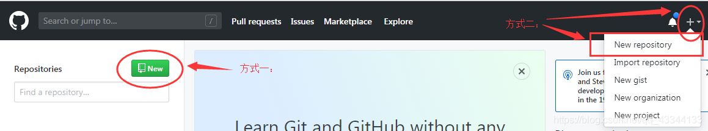
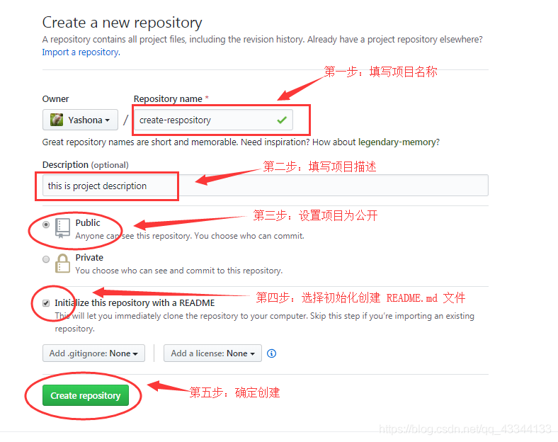
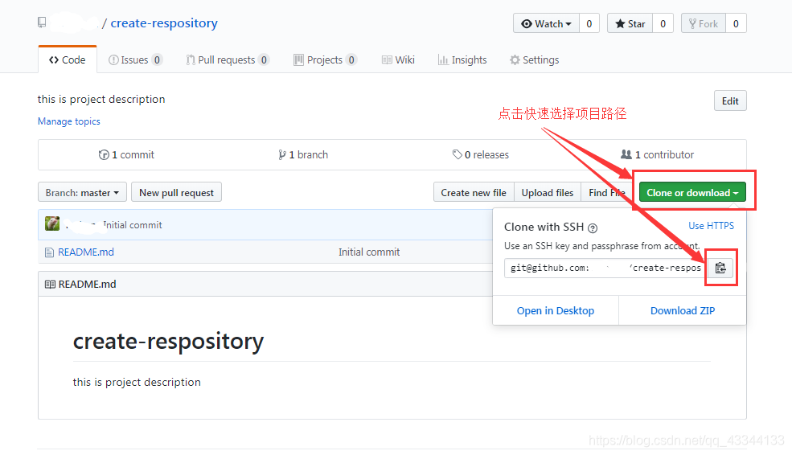
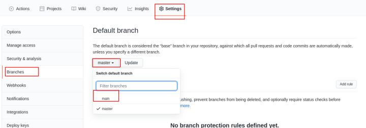
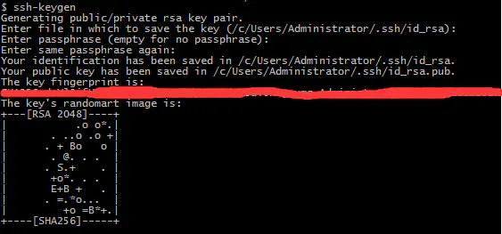
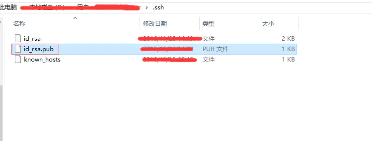
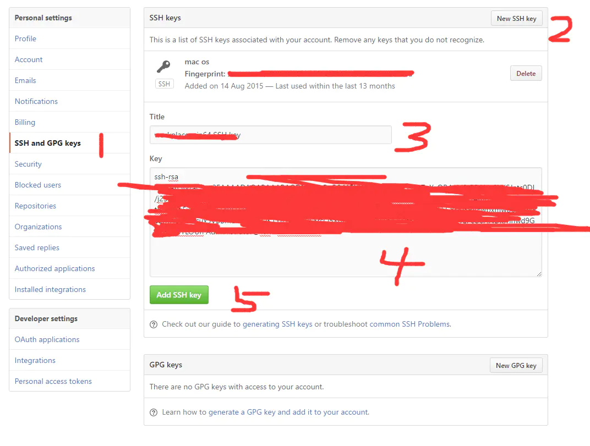

## 1.创建项目仓库
首先在git上创建项目仓库

进入创建仓库界面，填写设置选项

创建完成后，页面会跳转到刚创建好的项目界面，复制 github 连接路径

## 本地连接github仓库
1.打开git bash，配置本地git：

git config --global user.email "github设置的邮箱"

git config --global user.name "git上设置的用户名"

2.然后新建一个本地目录，在目录下面进行初始化：git init

之后远程连接github：git remote add origin git@github.com:XXXXXX/create-respository.git

之后将远程仓库的README.md文件pull到本地，避免后面提交报错：
git pull --rebase origin master

3.之后将本地代码提交到本地仓库中
git add --all
或者分别提交一个一个文件：
git add index.go login.go

之后确认提交到本地仓库
git commit -m "test1"

4.提交到远程仓库
git push -u origin master
现在github默认是main分支，可以提交到main分支，也可以将远程默认分支切换为master分支

这里可能出现报错：git@github.com: Permission denied (publickey).

原因是没有将本地的ssh key添加到远程仓库中。
如果本地有key，可以直接添加，没有的话先生成key。

使用ssh-keygen

生成key后在指定要存储的地方找到id_rsa.pub：

在github的Settings中新建一个SSH key，将id_rsa.pub中的内容复制到Key中

