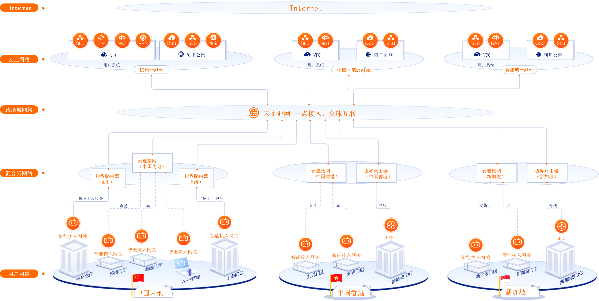
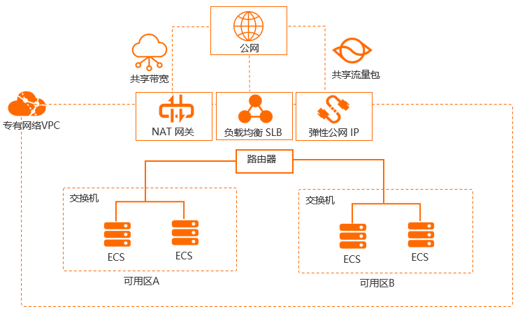

## 用户是如何接入云上网络的？

以阿里云为例，用户在云上购买网络，部署集群，然后通过pc端进行连接使用，不同地域会访问到
不同的区域云上网络
## 云上的网络是怎样的？

以阿里云为例，访问流量通过公网到达云上网络，首先经过NAT网关、负载均衡器、弹性公网IP之后到达某个路由器，
路由到私有网络的某个可用区域，然后经过交换机达到某个实例，最后访问该实例。

## 私有网络VPC
首先，企业需要购买云上的私有网络VPC。VPC本质上是一个网段，例如192.168.0.0/16.
企业可以在网段里面自定义IP地址段、创建交换机、配置路由和网关。也可以创建云服务器实例ECS、
云数据库和负载均衡等资源。

关于VPC的解释：https://blog.csdn.net/K_520_W/article/details/124139813
## VPN网关是什么？
VPN就是使用加密的通道将本地的数据中心、企业的网络或PC与百度云建立连接。

## VPN网关的应用场景
